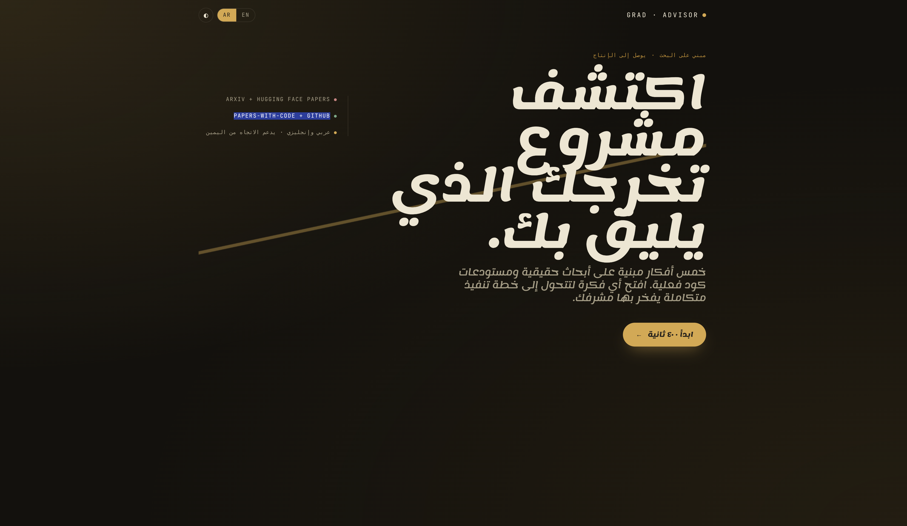
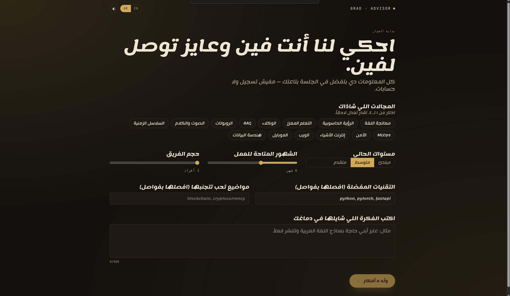
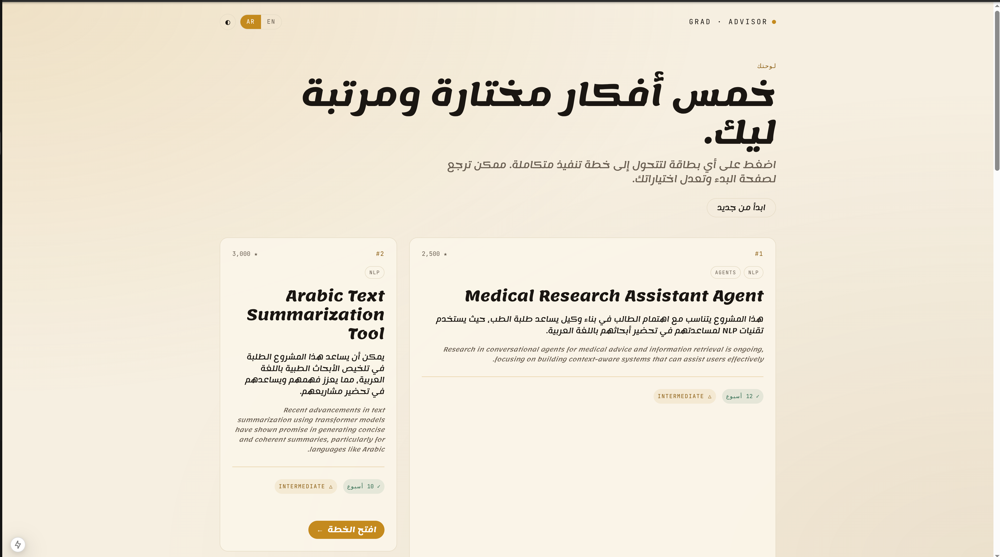
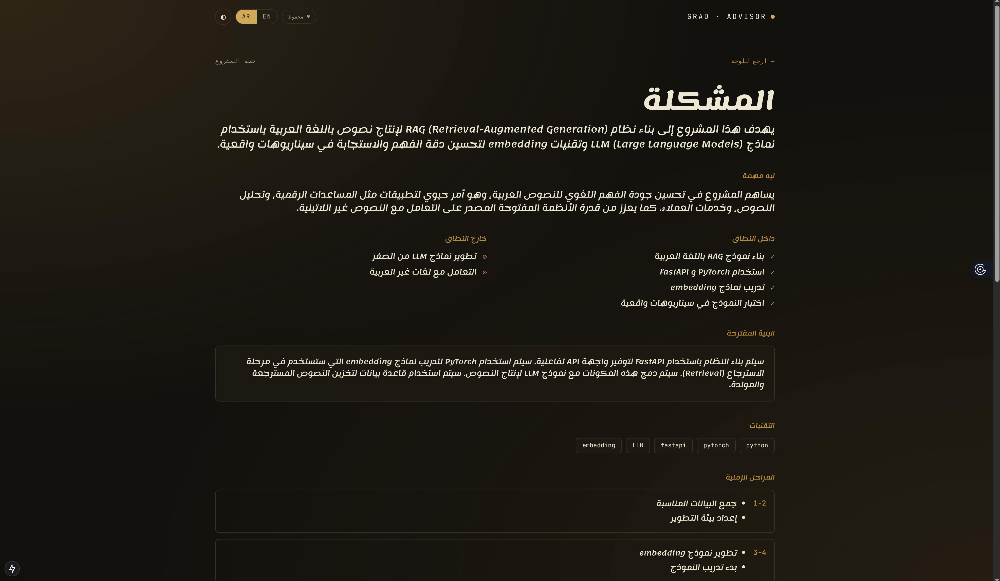

<div align="center">

# Graduation Project Advisor

**A grounded, bilingual research-to-project advisor for computer science students and early researchers.**

[](https://github.com/h9-tec/graduation-project-advisor/actions/workflows/backend-ci.yml)
[](https://github.com/h9-tec/graduation-project-advisor/actions/workflows/frontend-ci.yml)
[](https://www.python.org/)
[](https://nodejs.org/)
[](#stack)
[](#license)

_One form. Five citation-grounded ideas. A supervisor-ready blueprint in under a minute — in Arabic or English._



</div>

---

## What it does

Every computer science student eventually hits the same wall: *what should my final project actually be?* The usual answers are shallow ("build a todo app with auth"), disconnected from current research (no paper grounding, no clear novelty angle), or so overwhelming (raw arXiv feeds, endless GitHub trending, contradictory advice) that paralysis wins. Advisors rarely have ten hours per student to hand-curate a shortlist tailored to each student's background, timeline, and ambition.

**This tool closes that gap.**

A single form captures the student's domains, skill level, months available, team size, preferred stack, interests, and topics to avoid. The recommender retrieves from a live corpus of papers and repositories, scores candidates deterministically, asks a language model to re-rank the top twenty, and returns five cards — **every card citing a real paper or a real repository.** A single click expands any card into a thirteen-section blueprint anchored in that paper's real abstract and that repository's real README. Arxiv and GitHub URLs are injected post-generation so they can never be hallucinated. Where the source material is silent, the blueprint says so explicitly, rather than inventing.

No fabrication. No "coming soon" sections. No citation-free claims.

## Why it's different

| | Generic chat models | Paper search engines | This tool |
|---|---|---|---|
| Grounded in real, verifiable papers | Often fabricated | Yes | Yes — ids validated against the retrieved set, hallucinations dropped |
| Grounded in real, runnable code | No | No | Yes — real README fetched and passed to the blueprint prompt |
| Tailored to your specific profile | Weakly | No | Yes — nine-field intent profile drives retrieval + ranking + prompts |
| Supervisor-ready output | Freeform prose | Metadata | Yes — thirteen-section blueprint with scope, milestones, datasets, eval, risks |
| First-class Arabic support | Weak and brittle | English-only | Yes — RTL-correct, terminology preserved, typography tuned for Arabic |
| Free-text refinement with memory | Ephemeral | No | Yes — up to fifteen stackable refinements per session with single-click undo |
| Feedback that feeds evaluation | No | No | Yes — thumbs per card persisted with the full intent snapshot |

## Who it's for

- **Undergraduate students** finishing a capstone, senior project, or bachelor thesis. You have an intuition for your interests but no clear target. You need a shortlist grounded in research your advisor will recognize — not the output of a blank chatbot.
- **Master's and early-PhD researchers** exploring adjacent fields. The tool surfaces what has been published, what has been implemented, and what remains open — in the time it takes to read five abstracts.
- **Academic advisors** who don't have ten hours per student to curate. The tool produces a defensible first-pass longlist; you iterate with the student from there.
- **Engineering managers scouting R&D directions.** Deterministic scoring, real repositories, and explicit milestone planning translate cleanly to internal technical-debt exploration or greenfield prototyping.

## Screens

### Onboarding — the only form in the app

Domain chips, skill level, months available, team size, preferred stack, interests, and topics to avoid. No tracking, no login, no account. The profile lives in the server session (Redis, six-hour TTL) and is discarded when the tab closes.

<div align="center">
  
</div>

### The board — ranked ideas, not a chat transcript

Five cards in an asymmetric editorial layout, each grounded in a named research area and a named stack. Intentionally *not* a chat UI — students shouldn't have to prompt-engineer their own graduation project. A sticky refine bar at the bottom handles conversational follow-ups without commandeering the screen.

<div align="center">
  
</div>

### Blueprint — supervisor-ready

Every blueprint carries thirteen sections: problem statement, why it matters, in-scope / out-of-scope, suggested architecture, tech stack, milestones by week (typically six to seven phases across ten to sixteen weeks), datasets with URLs, evaluation metrics, risks and mitigations, differentiation ideas, plus real paper and repository references — with authoritative arXiv and GitHub URLs injected at the top post-generation so they can never be fabricated.

<div align="center">
  
</div>

Arabic section headings (المشكلة, ليه مهمة, داخل النطاق, التقنيات, المراحل الزمنية) stay in Arabic; technical tokens (`embedding`, `FastAPI`, `transformer`, `LLM`, `PyTorch`) stay in English. This is the bilingual contract every downstream generation honors.

## Architecture

```
┌──────────────────────────── request path ────────────────────────────┐

┌────────────────────┐   REST     ┌──────────────────────┐   ANN +     ┌──────────┐
│  Next.js 15 web    │◄─────────► │  FastAPI recommender │◄─────────── │  Qdrant  │
│  ar / en + RTL     │   JSON     │  stateless           │  filter     │          │
└────────────────────┘            └───────┬──────────────┘  top-50     └──────────┘
                                          │
                                          ▼
                               ┌──────────────────────┐
                               │  deterministic       │
                               │  pre-score → top 20  │
                               │                      │
                               │  LLM re-rank         │
                               │  (ids validated)     │
                               │                      │
                               │  LeanCard[5] with    │
                               │  real arxiv_url +    │
                               │  real github_url     │
                               └──────────────────────┘

┌────────────────────── ingestion path ────────────────────────────────┐

 HF Daily Papers API ──┐
 arXiv REST            ├─►  normalize + dedup  ─►  multilingual encoder
 GitHub Trending       ─┘   (arxiv_id / github)    (MiniLM, 384-d, CPU)
  via Crawl4AI                      │                      │
                                    ▼                      ▼
                         ┌─────────────────────────────────────┐
                         │  Postgres (ProjectCandidate)        │
                         │  +                                  │
                         │  Qdrant (payload-indexed points)    │
                         └─────────────────────────────────────┘

 Celery beat: HF daily every 6h · arXiv nightly · GitHub weekly
 Dead-letter table for failed items · per-run IngestionRun stats
 Observability: GET /api/v1/ingest/status

┌────────────── session + infrastructure ──────────────────────────────┐

           ┌──────────┐   ┌────────────┐   ┌─────────────────┐
           │ Postgres │   │   Redis    │   │  LLM gateway    │
           │ feedback │   │ sessions + │   │                 │
           │ + runs   │   │ card cache │   │  azure  │ ollama│
           └──────────┘   └────────────┘   └─────────────────┘
```

Three clean subsystems with narrow interfaces:

1. **Ingestion.** Three pipelines land normalized `ProjectCandidate` records into Postgres and Qdrant with multilingual embeddings. HF Daily Papers carries pre-generated `ai_summary` and `ai_keywords`, skipping an enrichment LLM call for most records. arXiv covers the long tail via a rate-limited REST loop. A Crawl4AI scraping agent pulls GitHub's weekly Python trending page (no official API exists). Celery beat schedules the three jobs at six-hour / nightly / weekly cadences with autoretry, dead-letter capture, and per-run statistics exposed at `/api/v1/ingest/status`.

2. **Recommender.** Stateless FastAPI that converts an `IntentProfile` into a query embedding, runs an ANN + payload-filter query against Qdrant, applies a deterministic pre-score (a weighted blend of cosine similarity, quality, recency, code availability, and difficulty match), takes the top twenty, and asks a small language model to re-rank them with strict id validation. The expansion endpoint pulls the real paper abstract and the real repository README before prompting the stronger model, so every blueprint is anchored in actual source material.

3. **Web.** Next.js 15 App Router, bilingual with RTL, FOUC-safe dark / light / system themes, self-hosted fonts. Server components render the page shell; client components cover the interactive bits (form, refine bar, card actions). No client state outside what each component owns; session state lives on the server.

## Features

- **Live ingestion from three canonical sources.** Hugging Face Daily Papers, arXiv, and GitHub trending, reconciled into one `ProjectCandidate` schema. Celery beat runs the pipelines at six-hour / nightly / weekly cadences with retry, dead-lettering, and per-run statistics.
- **Deterministic pre-scoring.** A five-term linear blend (similarity 0.50, quality 0.20, recency 0.10, code-availability 0.10, difficulty-match 0.10) keeps the top-50 → top-20 step reproducible across model upgrades.
- **LLM re-rank with strict id validation.** Ids that weren't in the retrieved set are dropped rather than surfaced. When every re-ranked id is invalid, the system falls back to a pure-LLM path rather than showing nothing.
- **Thirteen-section blueprints.** Problem, motivation, in-scope / out-of-scope, architecture, tech stack, weekly milestones, datasets, evaluation metrics, risks, differentiation, paper refs, repo refs. Real arXiv and GitHub URLs are prepended post-generation so they are never hallucinated.
- **Bilingual, RTL-correct.** Every view works in Arabic and English. Technical terms stay in English; reasoning wraps in the student's language. Typography pairs Fraunces / DM Sans (Latin) with Lemonada (Arabic) at 1.9 line-height so the script has vertical room.
- **Session-scoped, anonymous, ephemeral.** Six-hour Redis TTL, no login, no accounts, no cross-session tracking, no cookies beyond the session id.
- **Refinement with undo.** "More RL, less infra, cut the timeline to three months" — a sticky chat bar re-runs retrieval with a fifteen-refinement budget and a single-click undo stack.
- **Triage surface.** Thumbs-up / thumbs-down per card (persisted for offline evaluation), save-for-later, a saved-shortlist page, and a three-way compare panel.
- **Two LLM tiers, two providers.** Azure OpenAI (`gpt-4o-mini` fast, `gpt-4o` smart) or local Ollama (`llama3.2:3b` fast, `aya:8b` smart). One environment variable switches providers.
- **Prometheus-ready.** `/metrics` endpoint exposed from day one; domain-specific counters and histograms on the critical path.

## Quick start

Requirements: **Docker 27+** and **Docker Compose v2**. Optional: **Python 3.12** and **Node 22+** for running backend or frontend directly on the host.

```bash
git clone https://github.com/h9-tec/graduation-project-advisor.git graduation_project
cd graduation_project
cp .env.example .env
# Fill in your Azure OpenAI credentials, or flip LLM_PROVIDER=ollama for a fully local stack.

docker compose up -d --build
```

Wait roughly thirty seconds for health checks, then:

| URL | What |
|---|---|
| <http://localhost:3000/en> | English landing |
| <http://localhost:3000/ar> | Arabic landing (RTL) |
| <http://localhost:8010/healthz> | Backend liveness |
| <http://localhost:8010/metrics> | Prometheus metrics |
| <http://localhost:8010/docs> | FastAPI Swagger UI |
| <http://localhost:8010/api/v1/ingest/status> | Per-source ingestion stats |
| <http://localhost:6333/dashboard> | Qdrant dashboard |

### Host port cheat sheet

Compose deliberately remaps host ports so the stack does not clash with local Postgres or Redis instances developers already run.

| Service | Host port | Container port |
|---|---|---|
| Postgres | `5433` | 5432 |
| Redis | `6380` | 6379 |
| Backend (FastAPI) | `8010` | 8000 |
| Qdrant HTTP | `6333` | 6333 |
| Qdrant gRPC | `6334` | 6334 |
| Frontend (Next.js) | `3000` | 3000 |

Inside the compose network, services speak on their container ports (`postgres:5432`, `redis:6379`, `qdrant:6333`).

## LLM providers

A provider-neutral gateway routes fast-tier and smart-tier calls by the `LLM_PROVIDER` environment variable. Switching is one setting.

### Azure OpenAI (default)

```env
LLM_PROVIDER=azure
AZURE_OPENAI_ENDPOINT=https://<your-resource>.openai.azure.com/
AZURE_OPENAI_API_KEY=<your-key>
AZURE_OPENAI_API_VERSION=2024-10-21
AZURE_OPENAI_DEPLOYMENT_FAST=gpt-4o-mini
AZURE_OPENAI_DEPLOYMENT_SMART=gpt-4o
```

### Ollama (local, privacy-preserving)

```env
LLM_PROVIDER=ollama
OLLAMA_URL=http://localhost:11434
OLLAMA_MODEL_FAST=llama3.2:3b
OLLAMA_MODEL_SMART=aya:8b
```

`aya:8b` is chosen for the smart tier because it produces strong Arabic output alongside English.

On Linux hosts where iptables blocks docker→host traffic, run the backend on the host rather than in compose (see `docs/` for the exact command sequence), keeping infra in containers.

## Benchmarks

**Corpus:** 997 candidates across HF Daily Papers, arXiv, and GitHub trending (live as of this writing; refreshed every six hours).

**Latency against a real student profile:**

| Call | Provider / Model | Measured p50 |
|---|---|---|
| `POST /recommendations` | Azure `gpt-4o-mini` | ~ 3 s (5 cards) |
| `POST /sessions/{sid}/cards/{id}/expand` | Azure `gpt-4o` | ~ 6 s (full blueprint) |
| `POST /recommendations` | Ollama `llama3.2:3b` (RTX 5060 Laptop, 8 GB) | ~ 13 s |
| `POST /expand` | Ollama `aya:8b` (same hardware) | ~ 50 s |

**Embeddings:** `paraphrase-multilingual-MiniLM-L12-v2`, 384 dimensions, local CPU, cross-lingual Arabic ↔ English. A hybrid dense + BM25 retrieval and a cross-encoder re-ranker (`bge-reranker-v2-m3`) are on the near-term roadmap — see [Roadmap](#roadmap).

## API reference

All routes are under `/api/v1`. Request and response bodies are JSON. Pydantic validates on entry; the frontend mirrors the shape in `frontend/lib/api.ts`.

| Route | Verb | Purpose |
|---|---|---|
| `/recommendations` | POST | Submit an `IntentProfile`, receive five lean cards and a session id |
| `/sessions/{sid}` | GET | Full session state — cards + refinement count + undo stack depth |
| `/sessions/{sid}/cards` | GET | Current cards only |
| `/sessions/{sid}/cards/{card_id}/expand` | POST | Expand a card into a full blueprint, grounded in the real paper + README |
| `/sessions/{sid}/refine` | POST | Apply a free-text refinement; returns updated cards plus an assistant note |
| `/sessions/{sid}/refine/undo` | POST | Pop the most recent refinement; 400 when the stack is empty |
| `/feedback` | POST | Persist a thumbs up / down against a card (append-only, snapshot-bearing) |
| `/sessions/{sid}/saved` | GET / POST | List or add to the saved-cards shortlist |
| `/sessions/{sid}/saved/{card_id}` | DELETE | Remove a saved card |
| `/eval/dataset` | GET | Flatten recent feedback rows for the offline evaluation harness |
| `/ingest/status` | GET | Per-source last-run stats + unresolved dead-letter counts |

## Stack

| Layer | Tech |
|---|---|
| **Backend** | Python 3.12 · FastAPI · SQLAlchemy 2 async · Alembic · Pydantic v2 · Loguru |
| **Workers** | Celery 5 · Celery beat · autoretry with exponential backoff |
| **Data plane** | PostgreSQL 16 · Qdrant 1.16 · Redis 7 |
| **Embeddings** | `paraphrase-multilingual-MiniLM-L12-v2` — 384-dim, local CPU, cross-lingual Arabic ↔ English |
| **LLM (cloud)** | Azure OpenAI `gpt-4o-mini` (fast tier) · `gpt-4o` (smart tier) |
| **LLM (local)** | Ollama via OpenAI-compat, `llama3.2:3b` + `aya:8b` |
| **Scraping** | Crawl4AI — Apache 2.0, Playwright under the hood, Ollama-friendly |
| **Frontend** | Next.js 15 App Router · React 19 · TypeScript strict · Tailwind v4 · next-intl · Biome |
| **Type system** | Pydantic on the wire, TypeScript mirror in `frontend/lib/api.ts` |
| **Runtime** | Docker + Docker Compose |
| **CI** | GitHub Actions — backend lint / typecheck / test, frontend lint / typecheck / build / test |

## Design philosophy

The aesthetic has a name: **Manuscript meets Production.**

- **Scholarly editorial feel.** Fraunces display + DM Sans body for Latin; Lemonada display + body for Arabic. Size jumps are three-to-one, not one-and-a-half — a 64 px headline beside a 14 px label carries more authority than two shades of middle weight.
- **Terminal minimalism.** JetBrains Mono for domain chips, arXiv ids, star counts, milestone week ranges. No filler chrome.
- **Warm ink on cream.** A dominant warm ink (`#1a1612` light, `#f0e6d0` dark) against an aged-paper or near-black canvas, with a single sharp accent — manuscript gold `#c48a1e`. Never a gradient.
- **Not a chat clone.** The recommendation screen is an asymmetric board of idea cards, not a transcript. The refine bar sits quietly at the bottom. Students shouldn't have to prompt-engineer their own graduation project.
- **Direction-aware throughout.** CSS logical properties, `dir="rtl"` on the Arabic locale root, directional icons auto-flip, logos never flip. Arabic line-height is 1.9 versus 1.55 for Latin — Arabic script needs the extra vertical room.

Every color is a semantically named CSS custom property (`--color-canvas`, `--color-accent`, `--color-signal-code`, `--color-signal-paper`). Light and dark share the same semantic map; switching is a `data-theme` attribute on `<html>` plus a FOUC-safe inline boot script.

## Development

### Backend (on the host)

```bash
python -m venv .venv
source .venv/bin/activate
pip install -e 'backend/[dev]'

cd backend
DATABASE_URL="sqlite+aiosqlite:///./grad.db" alembic upgrade head
uvicorn api.main:app --reload
```

Tests, lint, typecheck:

```bash
cd backend
pytest tests/unit -v
ruff check . && ruff format --check .
mypy api core ingestion
```

### Frontend (on the host)

```bash
cd frontend
corepack pnpm install
corepack pnpm dev
```

Tests, lint, typecheck, production build:

```bash
cd frontend
corepack pnpm test
corepack pnpm lint
corepack pnpm typecheck
corepack pnpm build
```

### One-shot ingestion

The three pipelines have a CLI entry point for manual runs — identical to what Celery beat schedules:

```bash
cd backend && source ../.venv/bin/activate
python -m ingestion.run --source hf_daily_papers --days 30
python -m ingestion.run --source arxiv --days 3 --max-records 300
python -m ingestion.run --source github_trending --count 25
```

## Project layout

```
graduation_project/
├── backend/
│   ├── api/
│   │   ├── main.py                        FastAPI factory + lifespan + CORS
│   │   ├── routes/
│   │   │   ├── recommendations.py         POST /recommendations, /expand, /refine, /refine/undo
│   │   │   ├── feedback.py                POST /feedback, GET/POST/DELETE /saved, GET /eval/dataset
│   │   │   └── ingest_status.py           GET /ingest/status
│   │   └── schemas/                       IntentProfile · LeanCard · Blueprint · RefineRequest
│   ├── core/
│   │   ├── settings.py                    Pydantic Settings — single source of env truth
│   │   ├── logging.py                     Loguru JSON sink + bind_context helper
│   │   ├── session_store.py               Redis-backed profile + cards + refinement stack + saved hash
│   │   ├── db/                            SQLAlchemy base + ProjectCandidate, Feedback, IngestionRun, DeadLetter
│   │   ├── embeddings/                    sentence-transformers encoder + async Qdrant helpers
│   │   ├── llm/
│   │   │   ├── azure.py                   AsyncAzureOpenAI JSON-mode helper
│   │   │   ├── ollama.py                  AsyncOpenAI pointed at Ollama /v1
│   │   │   ├── gateway.py                 Provider-neutral chat_json(tier="fast"|"smart")
│   │   │   └── prompts.py                 Bilingual rec + grounded-blueprint + refine prompts
│   │   └── recommendation/
│   │       ├── retrieve.py                Build filter, ANN top-50, deterministic pre-score → top 20
│   │       └── context.py                 Fetch real README + full abstract before expansion prompts
│   ├── ingestion/
│   │   ├── pipelines/                     hf_papers.py, arxiv.py, github_trending.py (Crawl4AI)
│   │   ├── normalize.py                   NormalizedCandidate, content_hash, quality_score
│   │   ├── upsert.py                      Dedup + embed + atomic Postgres + Qdrant upsert
│   │   ├── runner.py                      Per-run IngestionRun row + per-item dead-letter capture
│   │   ├── celery_app.py                  Celery app + beat schedule (6h / nightly / weekly)
│   │   ├── tasks.py                       Celery tasks with autoretry + backoff
│   │   └── run.py                         One-shot CLI
│   ├── alembic/                           Schema migrations
│   ├── tests/                             pytest-asyncio, testcontainers-ready
│   ├── Dockerfile                         Multi-stage, non-root app user
│   └── pyproject.toml                     Hatchling + ruff + mypy strict + pytest-asyncio
├── frontend/
│   ├── app/[locale]/                      Bilingual App Router tree
│   │   ├── layout.tsx                     Bilingual html/dir, FOUC-safe theme boot, font pipeline
│   │   ├── page.tsx                       Asymmetric editorial landing
│   │   ├── onboard/page.tsx               The only form in the app
│   │   ├── board/[sid]/page.tsx           Board with sticky RefineBar
│   │   ├── blueprint/[sid]/[cardId]/      Grounded blueprint page
│   │   └── saved/page.tsx                 Saved shortlist + Compare-3
│   ├── components/                        idea-card, refine-bar, blueprint-view, saved-view, …
│   ├── lib/
│   │   ├── api.ts                         Typed fetch client mirroring Pydantic schemas
│   │   └── fonts.ts                       next/font — Fraunces, DM Sans, Lemonada, JetBrains Mono
│   ├── messages/{ar,en}.json              All i18n strings
│   ├── middleware.ts                      next-intl locale routing
│   └── i18n.ts                            next-intl config
├── docker-compose.yml                     postgres · qdrant · redis · backend · celery × 2 · frontend
├── .github/workflows/                     backend-ci.yml, frontend-ci.yml
├── docs/assets/                           Screenshots used by this README
├── .env.example                           Every env key, commented
└── README.md
```

## Security & privacy

- Anonymous sessions only — no passwords, no OAuth, no PII beyond an optional email (not enabled by default).
- `.env` is gitignored; `.env.example` ships placeholder values only.
- CORS locked to `FRONTEND_ORIGIN`, never `*`.
- Free-text fields (`interests_text`, refine messages) are length-capped at 500 characters and wrapped in `<untrusted_input>` markers inside the system prompt.
- Pydantic validates every payload at the API boundary; TypeScript types mirror the shape on the client.
- No user-supplied URLs are fetched server-side (SSRF guard). The only outbound URLs the ingestion layer reaches are arXiv, Hugging Face, and GitHub — all over HTTPS with an allow-list.
- Dependencies scanned by `pip-audit` and `npm audit` in CI; Dependabot watches `main`.
- Session data expires automatically after six hours and is never persisted to long-term storage.

## Roadmap

The following items are the next-quarter priorities, ordered by measured leverage on recommendation quality:

- **Hybrid retrieval (dense + BM25 sparse fusion).** Qdrant supports this natively via its Query API with Reciprocal Rank Fusion. Expected to materially improve recall on queries mentioning specific technical identifiers (library names, model architectures, dataset names).
- **Cross-encoder re-rank.** Replace the LLM re-rank step with `bge-reranker-v2-m3` — multilingual, deterministic, CPU-runnable, sub-100ms for top-50 → top-20. Structurally eliminates hallucinated ids and frees the LLM for rationale generation on five cards only.
- **Semantic Scholar citation integration.** Adds a research-maturity signal per card (established vs research-frontier) and unlocks citation-graph recommendations via the Recommendations API. Citations count, venue, and influential-citations data all surface on the card.
- **Offline evaluation harness.** Leave-one-out nDCG@5 and MRR tracked over time using the `/eval/dataset` endpoint already in place; prompt and model changes gated on no-regression.
- **Richer repository health signals.** Beyond stars — last-commit recency, issue response time, release cadence, single-maintainer flags, has-CONTRIBUTING. "Is this repo maintained enough to actually learn from?" becomes a first-class signal on the card.
- **Backend hardening.** Testcontainers-based integration suite, Prometheus metrics on the RAG + session critical path, module-level pooled async engine replacing per-request `create_async_engine`. Design spec and implementation plan are in `docs/superpowers/`.
- **Supervisor handoff.** A shareable public-read blueprint URL so students can paste a link to their advisor without either party needing an account. Lowest-friction go-to-market loop for academic contexts.

## Contributing

The project is private / license-TBD while we iterate. External contributions are welcome by invitation — open a GitHub issue describing your use case and we'll coordinate.

Pull request expectations:

- **Conventional commits** (`feat(scope):`, `fix(scope):`, `refactor(scope):`, `docs(scope):`). One concern per commit. Prefer small PRs (XS–M) over large ones.
- **Tests before implementation** for non-trivial changes. The codebase is opinionated about TDD for orchestration-layer work.
- **CI green before review.** Lint, typecheck, unit tests, and integration tests all must pass on the PR branch before requesting review.
- **Functional changes separate from formatting changes.** Don't mix a bug fix with a `ruff format` run — they go in different PRs.
- **No schema changes without a migration.** Every Alembic revision must include both `upgrade` and `downgrade`.

## Credits

Built by **Hesham Haroon** — AI/NLP engineer focused on Arabic-first AI systems, agentic platforms, RAG, and production GenAI infrastructure. This project is part of a broader portfolio that includes [`al-muwatta-ai`](https://github.com/h9-tec) (Islamic knowledge RAG), [`dhakira`](https://github.com/h9-tec) (Arabic agent memory), and related Arabic-NLP work.

Reach out: [github.com/h9-tec](https://github.com/h9-tec) · heshamharoon19@gmail.com.

## License

**Private / TBD.** Licensing terms will be finalized before any public release. For evaluation, academic collaboration, or institutional deployment inquiries, please reach out.
